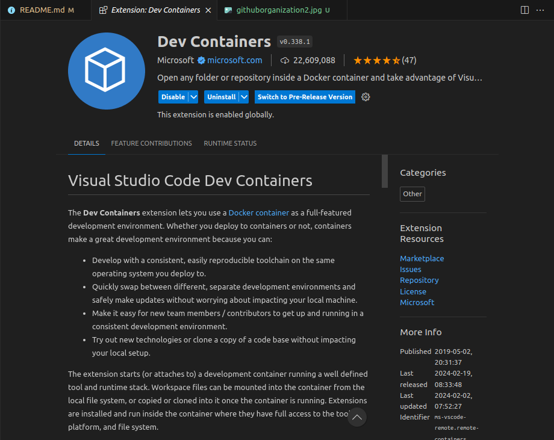

<!-- PROJECT SHIELDS -->
<!--
*** I'm using markdown "reference style" links for readability.
*** Reference links are enclosed in brackets [ ] instead of parentheses ( ).
*** See the bottom of this document for the declaration of the reference variables
*** for contributors-url, forks-url, etc. This is an optional, concise syntax you may use.
*** https://www.markdownguide.org/basic-syntax/#reference-style-links
-->
[![LinkedIn][linkedin-shield]][linkedin-url]


<!-- PROJECT LOGO -->
<br />
<p align="center">
  <a href="https://github.com/Pakoke/github-organization">
    
  </a>

  <h3 align="center">Github Organization</h3>

  <p align="center">
    This project is going to build our entire infrastructure on our Github Organization. In this proyect, we are going to build a basic organization and their team structure
    <br />
    <a href="https://github.com/Pakoke/github-organization"><strong>Explore the docs »</strong></a>
    <br />
    ·
    <a href="https://github.com/Pakoke/github-organization/issues">Report Bug</a>
    ·
    <a href="https://github.com/Pakoke/github-organization/issues">Request Feature</a>
  </p>
</p>


<!-- TABLE OF CONTENTS -->
<details open="open">
  <summary><h2 style="display: inline-block">Table of Contents</h2></summary>
  <ol>
    <li>
      <a href="#about-the-project">About The Project</a>
      <!-- <ul>
        <li><a href="#built-with">Built With</a></li>
      </ul> -->
    </li>
    <li>
      <a href="#getting-started">Getting Started</a>
      <ul>
        <li><a href="#prerequisites">Prerequisites</a></li>
        <li><a href="#installation">Installation</a></li>
      </ul>
    </li>
    <li><a href="#usage">Usage</a></li>
    <li><a href="#contributing">Contributing</a></li>
    <li><a href="#license">License</a></li>
    <li><a href="#contact">Contact</a></li>
    <li><a href="#acknowledgements">Acknowledgements</a></li>
  </ol>
</details>


<!-- ABOUT THE PROJECT -->
## About The Project

The problem to solve is about showing how to fully deploy a GitHub Organization using Terraform and the provider of [Github](https://registry.terraform.io/providers/integrations/github/latest/docs).
On this project, we are going to build diferents Github components which it will end up having an fully deployed organization where a Team of developers can start coding and deploying the code efficiently. Using an existing organization and a token (to simplify the problem) we are going to fully create an organization easily manage by Terraform.

### Built With

* [Terraform](https://www.terraform.io/)
* [Github](https://docs.github.com/en/organizations)

<!-- GETTING STARTED -->
## Getting Started

This project and all the resources will help you to build and deploy the infrastructure. The component deployed are going to be the enough to start a new organization.

### Prerequisites

This is what you need to initialize the proyect:
* VSCode: [link](https://code.visualstudio.com/docs/setup/setup-overview)
* Docker: [link](https://www.docker.com/get-started/)
* Devcontainer VSCode Extension: [link](https://code.visualstudio.com/docs/devcontainers/containers) This is needed to install al the tools to run the proyect



* Github Organization:  These can be created for free as part of a personal GitHub account by selecting Profile → Your organizations → New organization

### Installation

1. Clone the repo
    ```
    git clone https://github.com/Pakoke/github-organization.git
    ```
2. Go to the folder ``organization``
    ```
    cd ./organization
    ```
3. Configure your token credentials and organization id. For the sake of this example, I recommend to create an token with Admin permissions.
    ```
    variable "github_organization" {
        default     = "organization_id"
    }

    variable "github_token" {
        default     = "token"
    }
    ```
4. Initialize the Terraform project and apply the plan to get all the information that we will need for set up our pipeline.
    ```
    terraform init
    terraform apply --auto-approve
    ```
5. As soon as it finish, you will have your entire organization built.

6. Modify teams, permissions and add new users to your organization. To achieved that, you just need to open the file ``organization_structure.tf`` and update each object related with part of the organization. 


<!-- USAGE EXAMPLES -->
## Usage

At this point, you will have your entire organization built with the basics. To see that it is working and you have your entire infrastructure created, we need to understand each section simplify on our file ``organization_structure.tf``.

On our organization we are going to have three sections:
1. User structure: This section will consist on building and mantaining the users of users that are going to be part on our organization 

    ```
    user_structure = [
        {
        username = "Ruiz"
        role     = "member"
        },
        {
        username = "FranciscoJavier"
        role     = "member"
        }
    ]
    ```

    Add a new user name on this structure will end up in an invitation on our organization.

2. Team structure: This section will handle the creation of all of our Teams.

    ```
    team_structure = [
    {
      team_name   = "frontend-team"
      description = "Cool frontend Team"
      users = [{
        user_name = "Ruiz",
        role      = "member"
      }]
    },
    {
      team_name   = "backend-team"
      description = "Cool frontend Team"
      users = [{
        user_name = "FranciscoJavier",
        role      = "member"
      }]
    }
    ]
    ```

3. Repo structure: Thanks to this section, we will managed all the resources related with our repo and permissions related. 

   ```
    repo_structure = [
    {
      repo_name   = "voxsmart-service-api"
      description = "This is an awesome api"
      visibility  = "private"
      repo_options = {
        has_issues      = true
        has_discussions = true
        has_projects    = true
        has_wiki        = true
      }
      teams = [
        {
          team_name   = "backend-team",
          permissions = "admin"
        },
        {
          team_name   = "backend-team",
          permissions = "pull"
        }
      ]
    },
    ...
    ]
   ```
   Each repo will have the option to create additional information related to it. Of course every time that we create a new repo, this one will be assign to a team at least.


<!-- LICENSE -->
## License

Distributed under the MIT License. See `LICENSE` for more information.

<!-- CONTACT -->
## Contact

Francisco Javier Ruiz - [@twitter_handle](https://twitter.com/twitter_handle) - jrdt1991@gmail.com

Project Link: [https://github.com/Pakoke/github-organization](https://github.com/Pakoke/github-organization)


<!-- MARKDOWN LINKS & IMAGES -->
<!-- https://www.markdownguide.org/basic-syntax/#reference-style-links -->
[contributors-shield]: https://img.shields.io/github/contributors/Pakoke/repo.svg?style=for-the-badge
[contributors-url]: https://github.com/Pakoke/repo/graphs/contributors
[forks-shield]: https://img.shields.io/github/forks/Pakoke/repo.svg?style=for-the-badge
[forks-url]: https://github.com/Pakoke/repo/network/members
[stars-shield]: https://img.shields.io/github/stars/Pakoke/repo.svg?style=for-the-badge
[stars-url]: https://github.com/Pakoke/repo/stargazers
[issues-shield]: https://img.shields.io/github/issues/Pakoke/repo.svg?style=for-the-badge
[issues-url]: https://github.com/Pakoke/repo/issues
[license-shield]: https://img.shields.io/github/license/Pakoke/repo.svg?style=for-the-badge
[license-url]: https://github.com/Pakoke/repo/blob/master/LICENSE.txt
[linkedin-shield]: https://img.shields.io/badge/-LinkedIn-black.svg?style=for-the-badge&logo=linkedin&colorB=555
[linkedin-url]: https://es.linkedin.com/in/fjaviruiztorres
